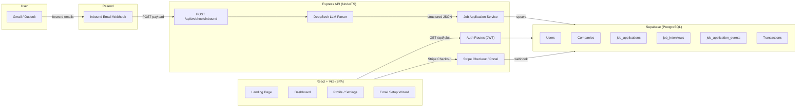

# TrackyJoby — Project Documentation

## What Is TrackyJobby?

**TrackyJobby** is a SaaS web application that **automatically tracks job applications** by parsing forwarded emails using AI. Instead of manually updating spreadsheets, users forward their job-related emails (confirmations, interview invites, offers, rejections) to a personal `@trackyjobby.com` alias, and the system uses an LLM to extract structured data and populate a live dashboard.

**Live domain**: [trackyjobby.com](https://trackyjobby.com)

---

## Architecture Overview

---

## Tech Stack

| Layer       | Technology                                                       |
|-------------|------------------------------------------------------------------|
| **Frontend**| React 19, Vite, TypeScript, react-router-dom v7, Axios, Lucide  |
| **Backend** | Express 5, TypeScript, JWT auth (jsonwebtoken + bcryptjs)        |
| **Database**| Supabase (PostgreSQL) — managed via service key                  |
| **AI/LLM**  | DeepSeek Chat (via OpenAI SDK, `deepseek-chat` model)            |
| **Email**   | Resend (inbound email webhooks + transactional emails)           |
| **Payments**| Stripe (Checkout Sessions, Customer Portal, Webhooks)            |
| **Deploy**  | Docker Compose → VPS with host Nginx reverse proxy               |

---

## The Core Pipeline: Email → Dashboard

This is the heart of TrackyJobby. Here's the step-by-step flow:

### 1. User Sets Up Email Forwarding
- During onboarding, the user picks a unique alias (e.g., `ayodeji`) → becomes `ayodeji@trackyjobby.com`
- The `EmailClientSetupPage` (`frontend/src/pages/EmailClientSetupPage.tsx`) walks you through configuring Gmail/Outlook forwarding

### 2. Resend Catches the Inbound Email
- Resend is configured with a webhook at `POST /api/webhook/inbound`
- The webhook handler (`backend/src/routes/webhook.ts`) looks up the user by their `mail_forwarder` alias

### 3. Gmail Forwarding Verification (Special Case)
- If the email is a "Gmail Forwarding Confirmation", the system captures the verification URL and stores it as an **alert** so the user can complete the setup from within the app

### 4. AI Parses the Email
- `llmParser.ts` (`backend/src/utils/llmParser.ts`) sends the email subject + body to **DeepSeek** with a detailed prompt
- The LLM classifies whether it's a real job application update (vs. "job alerts" spam) and extracts: `companyName`, `companyDomain`, `jobTitle`, `status`, `salaryRange`, `locationType`, and any `interviews`

### 5. Job Application Service Processes the Data
- `jobApplicationService.ts` (`backend/src/services/jobApplicationService.ts`) handles:
  - **Company resolution**: match by domain → match by name → create new (auto-fetches logo from Brandfetch)
  - **Duplicate detection**: strict match (company + title), then fuzzy match (any active app at same company)
  - **Upsert logic**: updates existing application status or creates a new one
  - **Event tracking**: records every status change and interview scheduling in `job_application_events`
  - **Interview creation**: deduplicates and inserts scheduled interviews

### 6. Dashboard Displays Everything
- The `DashboardPage` (`frontend/src/pages/DashboardPage.tsx`) fetches jobs via `GET /api/jobs`, shows metrics (total, active, interviews, offers), job cards with company logos, and a detail modal with an **application journey timeline**

---

## Database Schema

8 tables in Supabase (defined in `backend/supabase_schema.sql`):

| Table                    | Purpose                                                    |
|--------------------------|------------------------------------------------------------|
| `users`                  | Auth, email, alias, subscription status, Stripe IDs        |
| `companies`              | Company name, domain, logo URL (auto-populated)            |
| `job_applications`       | Core tracking: title, status, salary, location, dates      |
| `job_interviews`         | Interview rounds: type, date, duration, meeting link       |
| `job_application_events` | History log: every status change, interview scheduled       |
| `alerts`                 | System alerts (e.g., Gmail forwarding verification links)  |
| `feedback`               | User feedback/complaints/feature requests                  |
| `transactions`           | Stripe payment history (invoices, amounts, status)         |

---

## Backend API Routes

| Route                               | Auth? | Description                                  |
|--------------------------------------|-------|----------------------------------------------|
| `POST /api/auth/register`           | No    | Create account, send verification email      |
| `GET  /api/auth/verify/:token`      | No    | Verify email, return JWT                     |
| `POST /api/auth/login`              | No    | Login with email/password                    |
| `GET  /api/auth/me`                 | Yes   | Get current user profile                     |
| `POST /api/auth/setup-forwarder`    | Yes   | Set the email alias                          |
| `GET  /api/auth/forwarding-verification` | Yes | Get Gmail verification URL from alerts  |
| `GET  /api/jobs`                     | Yes   | List all job applications with events        |
| `GET  /api/jobs/interviews`          | Yes   | List upcoming interviews                     |
| `POST /api/feedback`                 | Yes   | Submit feedback (also emails admin)          |
| `POST /api/payment/create-session`   | Yes   | Create Stripe Checkout session               |
| `POST /api/payment/create-portal-session` | Yes | Create Stripe Customer Portal session   |
| `POST /api/webhook/stripe`          | No    | Stripe webhook (raw body for signature)      |
| `POST /api/webhook/inbound`         | No    | Resend inbound email webhook                 |
| `GET  /api/health`                   | No    | Health check                                 |

---

## Frontend Pages

| Page                    | Route                      | Purpose                                        |
|-------------------------|----------------------------|-------------------------------------------------|
| LandingPage             | `/`                        | Marketing page with features, pricing, CTA      |
| AuthPage                | `/auth/login`, `/auth/register` | Login and registration forms                |
| VerifyPage              | `/verify/:token`           | Email verification callback                     |
| PlanSelectionPage       | `/plan-selection`          | Stripe plan picker (monthly €2 / yearly €15)    |
| EmailClientSetupPage    | `/setup/email-client`      | Email forwarding setup wizard                   |
| VerifyForwardingPage    | `/setup/verify-forwarding` | Gmail forwarding verification                   |
| DashboardPage           | `/dashboard`               | Main dashboard with job cards + metrics         |
| ProfilePage             | `/profile`                 | Account, subscription, alias management         |

**Route protection**: unauthenticated users are redirected to `/auth/login`. Users without a subscription are redirected to `/plan-selection` via `RequireSubscription` (`frontend/src/components/RequireSubscription.tsx`).

---

## Monetization

- **Monthly**: €2/month (Stripe subscription with 3-day free trial)
- **Yearly**: €15/year (~37.5% discount)
- **Lifetime**: Coming soon (one-time payment)
- Stripe Checkout handles the payment flow; the Stripe webhook updates `subscription_status` in the DB
- Users can manage billing/cancel via Stripe Customer Portal (opens from Profile page)

---

## Deployment

- **Docker Compose** with two containers: `trackyjobby-api` (backend on port 3001) and `trackyjobby-web` (frontend served by Nginx on port 80, exposed on 3000)
- Both bind to `127.0.0.1` only — a host **Nginx reverse proxy** on the VPS handles SSL and public traffic for `trackyjobby.com`
- `deploy.sh` automates: `git pull` → `docker compose up --build -d`

---

## Key Design Decisions

1. **DeepSeek over OpenAI** — uses the OpenAI SDK but points to `api.deepseek.com` for cost-effective LLM parsing
2. **Brandfetch for logos** — auto-generates company logo URLs from domain names
3. **Fuzzy duplicate matching** — prevents duplicate job entries when the same company sends multiple emails
4. **Events-based history** — every status change is recorded, enabling the "Application Journey" timeline in the modal
5. **Stripe raw body middleware** — `express.raw()` is registered before `express.json()` specifically for the Stripe webhook route to preserve the raw body for signature verification
